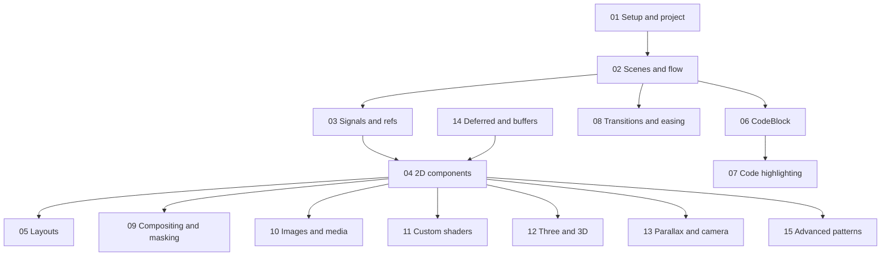

# Motion Canvas Documentation for AI Coders

Motion Canvas is a TypeScript-based tool for programming declarative animations and exporting them to video. This documentation is derived from `repos/examples/examples` and is structured so an AI agent can quickly find the right technique and copy minimal, runnable snippets.

- [Official Motion Canvas docs](https://motioncanvas.io/docs/)

---

## Technique index

| Technique / Use case | Doc | Example(s) |
|---------------------|-----|------------|
| Project setup, Vite, scenes, audio | [01-setup-and-project](01-setup-and-project.md) | motion-canvas, asset-code, smooth-parallax |
| Scenes, waitUntil, all, loop, cancel, join | [02-scenes-and-flow](02-scenes-and-flow.md) | signals, layouts, parallax, asset-code |
| createSignal, createComputed, createRef, makeRef* | [03-signals-and-refs](03-signals-and-refs.md) | signals, layouts, intro (asset-code), parallax |
| Node, Rect, Circle, Line, Txt, Img, Path, Grid, Ray | [04-2d-components](04-2d-components.md) | logo, interface, editor, division |
| Layout, direction, grow, gap, reactive grow | [05-layouts](05-layouts.md) | layouts, editor, deferred-lighting/layers |
| CodeBlock: edit, insert, selection, lines/word | [06-code-block](06-code-block.md) | signalsCode, layoutsCode |
| Code, LezerHighlighter, CODE``, append/prepend | [07-code-highlighting](07-code-highlighting.md) | mesh, state-machine, asset-code/Code |
| slideTransition, zoomIn/Out, ease*, map, arcLerp | [08-transitions-and-easing](08-transitions-and-easing.md) | layouts, interface, parallax, anniversary |
| compositeOperation, clip, cache, blur | [09-compositing-and-masking](09-compositing-and-masking.md) | logo, anniversary, lightBasics |
| Img, Gradient, video, SVG, Path | [10-images-and-media](10-images-and-media.md) | anniversary, editor, mesh, lightBasics |
| Custom GLSL: shaders, fragment, uniforms | [11-custom-shaders](11-custom-shaders.md) | intro, division, division2, shader-graph |
| Three.js / WebGL, Tetrahedron, rerender | [12-three-and-3d](12-three-and-3d.md) | editor, mesh, deferred-lighting |
| Parallax, FOV, zoomInTransition(BBox) | [13-parallax-and-camera](13-parallax-and-camera.md) | parallax, layers, upscale |
| GBuffer, LBuffer, Frame, multiply/lighter | [14-deferred-and-buffers](14-deferred-and-buffers.md) | lightBasics, color, normals |
| createRefMap/Array, Ray, CubicBezier, tween(fn), reparent | [15-advanced-patterns](15-advanced-patterns.md) | editor, state-machine, shader-graph, layers |

---

## Doc dependency (conceptual)

- **Flow** (02) depends on **signals/refs** (03) for refs in scenes; **CodeBlock** (06) depends on flow.
- **Shaders** (11) and **Three** (12) are optional extensions built on 2D components.

---

## For AI agents

- **Each doc is self-contained.** Use [agent-quickref.md](agent-quickref.md) to jump from "I need X" to the right doc and a 1-line snippet.
- **Snippets** are ready to paste into `makeScene2D(function* (view) { ... })`; adapt imports and variable names as needed.
- **Example paths** in this repo use `repos/examples/examples/<project>/src/...` (e.g. `repos/examples/examples/motion-canvas/src/scenes/signals.tsx`).

---

## All doc links

- [01-setup-and-project](01-setup-and-project.md)
- [02-scenes-and-flow](02-scenes-and-flow.md)
- [03-signals-and-refs](03-signals-and-refs.md)
- [04-2d-components](04-2d-components.md)
- [05-layouts](05-layouts.md)
- [06-code-block](06-code-block.md)
- [07-code-highlighting](07-code-highlighting.md)
- [08-transitions-and-easing](08-transitions-and-easing.md)
- [09-compositing-and-masking](09-compositing-and-masking.md)
- [10-images-and-media](10-images-and-media.md)
- [11-custom-shaders](11-custom-shaders.md)
- [12-three-and-3d](12-three-and-3d.md)
- [13-parallax-and-camera](13-parallax-and-camera.md)
- [14-deferred-and-buffers](14-deferred-and-buffers.md)
- [15-advanced-patterns](15-advanced-patterns.md)
- [agent-quickref](agent-quickref.md)
